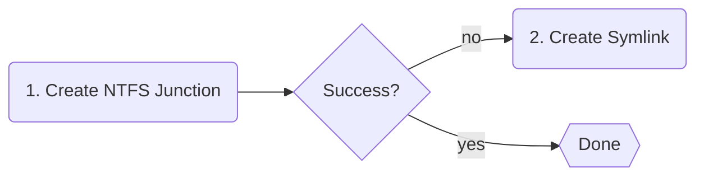

# Operating Modes

NVM for Windows operates in one of two modes: link or shim. The mode can be toggled at any time.

```powershell title="Setting the Operational Mode"
# Easy access
nvm use shim
nvm use link

# Also available in the nvm configuration
nvm cfg set mode=shim
nvm cfg set mode=link
```

## Link Mode

Link mode uses NTFS junctions and symlinks to identify the active/default system-wide version of `node.exe`.

NVM for Windows manages a junction called `.nodejs`. This NTFS junction is part of the `PATH`. The target is updated any time [`nvm use`](../command/use) changes the default version.

Link mode offers the closest possible experience to running Node.js "as delivered" by [nodejs.org](https://nodejs.org).It is operationally identical to v1, but implemented very differently. This mode offers zero latency, but does not provide any advanced modern workflow features.

Version 2.0.0 introduced the "fallback" link creation strategy.



NTFS Junctions do not require special permissions, but will not work with [UNC paths](https://learn.microsoft.com/en-us/dotnet/standard/io/file-path-formats#unc-paths) (e.g. remote network shares). If you attempt to link to a UNC path, nvm-windows attempts to create a symlink instead of a junction. Windows requires special permissions to create symlinks.

:::tip
Creation of symlinks requires `SeCreateSymbolicLinkPrivilege`. This is granted when Developer Mode is enabled (recommended), or for administrators. It can also be granted with Group Policy Objects.
:::

:::warning
Unlike prior versions, NVM for Windows will not attempt to elevate permissions (i.e. no UAC prompt) on failure of symlink creation. If permissions block the creation of a link, the user is notified (desktop notification).
:::

## Shim Mode (default)

Shim mode offers a streamlined developer experience. The tradeoff is addtional latency (~25-35ms total).

Most users won't notice or feel the impact of shim latency, but may feel the impact of a workflow encumbered by esoteric permission requirements. Therefore, shim mode is recommended for most users.

Shim mode offers:

1. Directory/project-level version detection via `.nvmrc`, `.node-version`, `package.json`, or custom run command files.
1. Automatic installation of missing versions.
1. Proxy support.[^1]
1. Security policy enforcement.[^2]
1. Auditing & observability.[^3]
1. Unified module cooldown periods (npm, pnpm, yarn).[^4]

[^1]: Corporate proxy types such as IWA & WPAD/PAC are only available in certified builds (governance edition). Basic proxy support is available in all editions.

:::info
Windows has a "universal latency tax". It uses [`CreateProcessW`](https://learn.microsoft.com/en-us/windows/win32/api/processthreadsapi/nf-processthreadsapi-createprocessw) to launch _any_ executable. This tax is paid when the shim is launched and again when the shim runs `node.exe`. On average, `CreateProcessW` takes 15ms. The shim adds 1-3ms to identify the desired Node.js version and securely relay the command.

`15ms (shim CreateProcessW) + 3ms (shim logic) + 15ms (shim CreateProcessW) = 33ms`
:::

## Comparison

||Link Mode|Shim Mode|
|:-|:-:|:-:|
|Latency|0ms|15-35ms|
|System Version|:heavy_check_mark:|:heavy_check_mark:|
|Automatic Installtion|:heavy_check_mark:|:heavy_check_mark:|
|Automatic Version Detection|:x:|:heavy_check_mark:|
|Special Permissions<br/><br/>|[`SeCreateSymbolicLinkPrivilege`](https://learn.microsoft.com/en-us/previous-versions/windows/it-pro/windows-10/security/threat-protection/security-policy-settings/create-symbolic-links)<br/>_for [UNC path](https://learn.microsoft.com/en-us/dotnet/standard/io/file-path-formats#unc-paths) symlinks_|None<br/><br/>|


[^1]: Latency is predominantly from Windows `CreateProcessW` universal latency tax. The shim executable only adds ~1ms latency.
[^2]: Self-configured security policies are available in the community edition and certified distribution/audit editions. Centralized policy enforcement is available in the certified governance edition.
[^3]: Plaintext logging is available in the community edition and certified distribution editions. Advanced (SIEM) logging is available in the certified audit/governance editions.
[^4]: Define one duration (i.e. block module installations which are under 2 days old) for all major package managers without creating custom settings for each one.