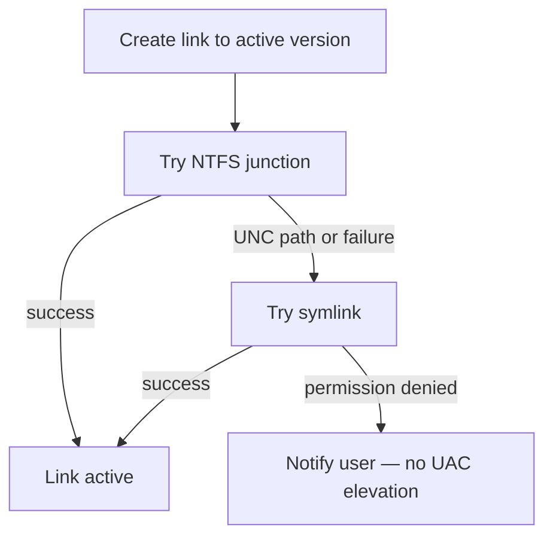

# Operating Modes 2

NVM for Windows operates in one of two modes: link or shim. This mode can be toggled at any time.

```powershell title="Setting the Operational Mode"
nvm use shim
nvm use link

# Also available in the nvm configuration

nvm cfg set mode=shim
nvm cfg set mode=link
```

## Link Mode

This mode uses links to locate the active system-wide version of `node.exe`. The `shim -> node.exe` link is modified any time [`nvm use`](../commands/use) changes the default version.

Link mode offers the closest possible experience to running `node.exe` "as delivered" by [nodejs.org](https://nodejs.org). This mode offers zero latency, but potentially adds operational complexity.

Version 2 introduced the "fallback" link creation strategy.



1. Attempt to create a NTFS junction.
1. Attempt to create a symlink.

NTFS Junctions do not require special permissions, but will not work with [UNC paths](https://learn.microsoft.com/en-us/dotnet/standard/io/file-path-formats#unc-paths) (like remote network shares). If you attempt to link to a UNC path, nvm-windows attempts to create a symlink instead of a junction. Symlinks require special permissions.

:::tip
Creation of symlinks requires `SeCreateSymbolicLinkPrivilege`. This is granted when Developer Mode is enabled (recommended), or for administrators. It can also be granted through Group Policies.
:::

:::warning
Unlike prior versions, NVM for Windows will not attempt to elevate permissions (i.e. no UAC prompt) on failure of symlink creation. If permissions block the creation of a link, the user is notified (desktop notification).
:::

## Shim Mode (default)

Shim mode offers a streamlined developer experience. The tradeoff is addtional latency (~25-35ms total).

Most users won't notice or feel the impact of shim latency, but may feel the impact of a workflow encumbered by esoteric permission requirements. Shim mode is recommended for most users.

Shim mode offers:

1. Directory/project-level version detection via `.nvmrc`, `.node-version`, `package.json`, or other custom run command files.
1. Automatic installations of missing versions.

:::info
Windows has a "universal latency tax". It uses [`CreateProcessW`](https://learn.microsoft.com/en-us/windows/win32/api/processthreadsapi/nf-processthreadsapi-createprocessw) to launch _any_ executable. This tax is paid when the shim is launched and again when the shim runs `node.exe`. On average, `CreateProcessW` takes 15ms. The shim adds 1-3ms to identify the desired Node.js version and securely relay the command.

`15ms (shim CreateProcessW) + 3ms (shim logic) + 15ms (shim CreateProcessW) = 33ms`
:::

Shim mode also performs **runtime Authenticode verification** of the resolved `node.exe` before spawn. A per-user **verify cache** (TPM-signed entries in HKCU) keeps that check to ~1–2 ms on cache hits; missing cache or public key falls back to full verification (slower, still secure). See [Runtime Verify Cache](./verify-cache).

## Comparison

||Link|Shim|
|:-|:-:|:-:|
|Latency[^1]|0ms|25-35ms|
|System Version|:heavy_check_mark:|:heavy_check_mark:|
|Automatic Installtion|:heavy_check_mark:|:heavy_check_mark:|
|Automatic Version Detection|:x:|:heavy_check_mark:|
|Special Permissions<br/><br/>|[`SeCreateSymbolicLinkPrivilege`](https://learn.microsoft.com/en-us/previous-versions/windows/it-pro/windows-10/security/threat-protection/security-policy-settings/create-symbolic-links)<br/>_for [UNC paths](https://learn.microsoft.com/en-us/dotnet/standard/io/file-path-formats#unc-paths) symlinks_|None<br/><br/>|


[^1]: Latency is predominantly from Windows `CreateProcessW` universal latency tax. The shim executable only adds ~1ms latency.
